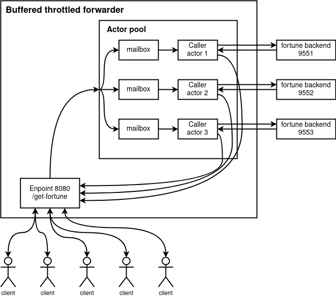

# Buffered throttled forwarder

This pet application represents a throttled router to multiple slow backends that can accept only 1 request at time.
The router provides buffering for requests that exceed the limit.

Implementation: akka typed.

The main idea is to use 1 actor for each slow backend.
Since each actor executes in a single-thread mode, if HTTP calls to a backend are made in synchronous way,
then actor itself plays the role of a throttle.
And the mailbox of the actor, plays the role of a buffer for incoming requests.

To balance the load, forwarder-actors are combined into a pool.

## How to run

0. Make sure you have installed:
* git
* sbt
* docker
* docket-compose

1. Clone sources

2. Navigate to sources root folder, and build universal distribution by executing `sbt dist`

3. Launch backend with command `docker-compose up -d`

4. Navigate to `target/universal` and unzip distribution archive wm_test-0.1.0.zip

5. Execute `wm_test-0.1.0/bin/wm_test` (make sure it is executable)

6. Navigate to http://localhost:8080/get-fortune several times and see logs in console

## Tests

Project contains a test that checks that application is able to handle
that number of request that is greater than number of backends.

This test expects backends to be up and running (using docker-compose).